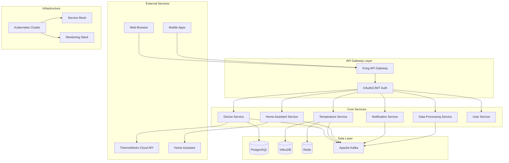

# PLANNING.md

## Project Vision & Mission

### Vision Statement
To create the most comprehensive, scalable, and user-friendly grill monitoring platform that bridges the gap between professional-grade thermometer hardware and smart home automation, enabling both casual grillers and barbecue enthusiasts to achieve perfect results every time.

### Mission
Transform grill monitoring from a manual, error-prone process into an intelligent, automated system that provides real-time insights, predictive analytics, and seamless integration with modern smart home ecosystems.

### Core Value Propositions

1. **Precision Monitoring**: Sub-second temperature accuracy with multi-probe support
2. **Smart Integration**: Seamless Home Assistant and smart home ecosystem integration
3. **Predictive Intelligence**: AI-powered cooking recommendations and timing predictions
4. **Enterprise Scalability**: Cloud-native architecture supporting unlimited devices
5. **Community Driven**: Open-source platform fostering grilling community innovation

## Strategic Goals

### Short-term (3-6 months)
- ✅ Complete core microservices architecture migration
- ✅ Implement robust user authentication and security
- ✅ Deploy production-ready Kubernetes infrastructure
- 🔄 Launch Home Assistant integration service
- 🔄 Develop mobile-responsive web interface

### Medium-term (6-12 months)
- ⏳ Mobile application development (iOS/Android)
- ⏳ Advanced analytics and cooking insights
- ⏳ Multi-tenant SaaS platform capabilities
- ⏳ Third-party thermometer brand integrations
- ⏳ Community marketplace for cooking profiles

### Long-term (12+ months)
- ⏳ AI-powered cooking assistant with machine learning
- ⏳ IoT gateway for direct hardware connectivity
- ⏳ Professional restaurant and commercial applications
- ⏳ International expansion and localization
- ⏳ Hardware partnerships and white-label solutions

## Architecture Overview

### System Architecture Philosophy

**Cloud-Native Microservices**: Distributed, scalable, and resilient architecture built on Kubernetes with clear service boundaries and data ownership.

**Event-Driven Design**: Asynchronous communication through message queues with eventual consistency and fault tolerance.

**Zero-Trust Security**: Security-first approach with end-to-end encryption, service mesh authentication, and principle of least privilege.

**Observability-First**: Comprehensive monitoring, tracing, and logging built into every service from day one.

### High-Level Architecture Diagram



### Service Architecture Patterns

#### Microservices Design Principles
- **Single Responsibility**: Each service owns a specific business capability
- **Database Per Service**: Data sovereignty with service-specific databases
- **API-First Design**: Well-defined contracts with OpenAPI specifications
- **Failure Resilience**: Circuit breakers, retries, and graceful degradation
- **Autonomous Teams**: Services can be developed and deployed independently

#### Communication Patterns
- **Synchronous**: REST APIs for real-time queries and commands
- **Asynchronous**: Event streaming for data synchronization and notifications
- **Request/Reply**: RPC-style communication for service-to-service calls
- **Publish/Subscribe**: Event broadcasting for system-wide notifications

### Data Architecture

#### Data Flow Strategy
1. **Ingestion**: Real-time temperature data collection from ThermoWorks API
2. **Processing**: Stream processing for real-time analytics and alerting
3. **Storage**: Time-series optimization with tiered retention policies
4. **Serving**: High-performance queries with Redis caching layer
5. **Analytics**: Batch processing for historical insights and ML training

#### Database Selection Rationale
- **PostgreSQL**: ACID compliance for device management and user data
- **InfluxDB**: Time-series optimization for temperature data
- **Redis**: Sub-millisecond caching and real-time streaming
- **Apache Kafka**: Reliable event streaming and message durability

## Technology Stack

### Core Technologies

#### Backend Services
- **Language**: Python 3.11+ (FastAPI/Flask)
  - Type hints with Pydantic for data validation
  - Async/await for high-concurrency operations
  - Rich ecosystem for scientific computing and ML
  
- **API Framework**: FastAPI
  - Automatic OpenAPI/Swagger documentation
  - Built-in request validation and serialization
  - High performance with async support
  - OAuth2 and JWT authentication

#### Frontend Technologies
- **Web Application**: React 18+
  - TypeScript for type safety and developer experience
  - Material-UI or Tailwind CSS for consistent design
  - React Query for server state management
  - Chart.js/D3.js for real-time data visualization

- **Mobile Application**: React Native
  - Cross-platform development efficiency
  - Native performance with bridge optimization
  - Shared business logic with web application
  - Push notifications and background processing

#### Database Technologies
- **PostgreSQL 15+**: Primary relational database
  - JSONB support for flexible schema evolution
  - Full-text search capabilities
  - Horizontal scaling with read replicas
  - Built-in backup and point-in-time recovery

- **InfluxDB 2.0+**: Time-series database
  - Optimized for high-write throughput
  - Built-in data retention and downsampling
  - Flux query language for complex analytics
  - Clustering and high availability

- **Redis 7.0+**: In-memory data store
  - Pub/Sub for real-time notifications
  - Distributed caching with clustering
  - Session storage and rate limiting
  - Message queuing with Redis Streams

#### Message Streaming
- **Apache Kafka**: Event streaming platform
  - Horizontal scalability and fault tolerance
  - Exactly-once delivery semantics
  - Stream processing with Kafka Streams
  - Schema registry for data evolution

### Infrastructure & DevOps

#### Container Orchestration
- **Kubernetes 1.28+**: Container orchestration
  - Declarative deployment and scaling
  - Service discovery and load balancing
  - Rolling updates and canary deployments
  - Resource quotas and auto-scaling

- **Helm 3.0+**: Package management
  - Templated Kubernetes manifests
  - Environment-specific configurations
  - Dependency management and versioning
  - Release management and rollbacks

#### Service Mesh & Networking
- **Istio 1.19+**: Service mesh
  - mTLS for service-to-service encryption
  - Traffic management and load balancing
  - Observability with distributed tracing
  - Security policies and access control

- **Cilium**: Container networking
  - eBPF-based high-performance networking
  - Network policies for zero-trust security
  - Load balancing and service mesh
  - Observability and troubleshooting

#### CI/CD Pipeline
- **Gitea Actions**: Source code management and CI/CD
  - Git-based workflow with branch protection
  - Automated testing and security scanning
  - Container image building and scanning
  - Deployment automation with GitOps

- **ArgoCD**: GitOps deployment
  - Declarative application delivery
  - Multi-environment promotion
  - Rollback and drift detection
  - RBAC and audit logging

#### Monitoring & Observability
- **Prometheus**: Metrics collection and alerting
  - Multi-dimensional time-series data
  - Powerful query language (PromQL)
  - Alertmanager for notification routing
  - Federation for multi-cluster monitoring

- **Grafana**: Visualization and dashboards
  - Rich visualization library
  - Dashboard templating and variables
  - Alerting with notification channels
  - User management and RBAC

- **Jaeger**: Distributed tracing
  - Request flow visualization
  - Performance bottleneck identification
  - Service dependency mapping
  - Trace sampling and storage

- **OpenTelemetry**: Instrumentation framework
  - Vendor-neutral observability
  - Automatic instrumentation for common libraries
  - Custom metrics and tracing
  - Export to multiple backends

#### Security & Compliance
- **OAuth2/OIDC**: Authentication and authorization
  - Industry-standard security protocols
  - Single sign-on (SSO) integration
  - Multi-factor authentication (MFA)
  - Token refresh and revocation

- **Vault**: Secret management
  - Encrypted secret storage
  - Dynamic secret generation
  - Access policies and audit logging
  - Integration with Kubernetes

### Development Tools

#### Code Quality & Testing
- **Pre-commit Hooks**: Code quality enforcement
  - Linting with flake8/pylint
  - Formatting with black/prettier
  - Security scanning with bandit
  - Dependency vulnerability checks

- **Testing Frameworks**:
  - pytest for Python unit and integration tests
  - Jest/React Testing Library for frontend
  - Testcontainers for integration testing
  - Artillery for load testing

#### Development Environment
- **Docker Compose**: Local development
  - Multi-service development environment
  - Hot reload and debugging support
  - Database seeding and test data
  - Environment variable management

- **Skaffold**: Cloud-native development
  - Kubernetes development workflow
  - Hot reload for containerized applications
  - Multi-environment configuration
  - CI/CD pipeline integration

## Required Tools & Dependencies

### Development Environment Setup

#### Essential Tools
```bash
# Container and Kubernetes tools
docker >= 20.10
kubectl >= 1.28
helm >= 3.0
skaffold >= 2.0

# Development tools
git >= 2.30
python >= 3.11
node >= 18.0
npm >= 9.0

# Code quality tools
pre-commit
black
flake8
pytest
```

#### Development Dependencies
```bash
# Python backend requirements
pip install fastapi uvicorn sqlalchemy alembic
pip install psycopg2-binary redis influxdb-client
pip install pydantic python-jose cryptography
pip install pytest pytest-asyncio httpx
pip install opentelemetry-api opentelemetry-sdk

# Node.js frontend requirements
npm install react react-dom typescript
npm install @mui/material @emotion/react @emotion/styled
npm install @tanstack/react-query axios
npm install chart.js react-chartjs-2
npm install @testing-library/react jest
```

### Infrastructure Requirements

#### Kubernetes Cluster
- **Minimum Specs**: 3 nodes, 4 CPU, 8GB RAM each
- **Recommended**: 5 nodes, 8 CPU, 16GB RAM each
- **Storage**: 100GB SSD per node
- **Network**: 1Gbps between nodes

#### Database Resources
- **PostgreSQL**: 2 CPU, 4GB RAM, 50GB storage
- **InfluxDB**: 4 CPU, 8GB RAM, 200GB storage
- **Redis**: 1 CPU, 2GB RAM, 10GB storage

#### External Service Dependencies
- **ThermoWorks Cloud API**: OAuth2 application registration
- **Home Assistant**: Long-lived access token
- **Email Service**: SMTP configuration for notifications
- **Push Notification**: Firebase Cloud Messaging setup

### Deployment Environments

#### Development Environment
```yaml
# Resource allocation (minimal)
replicas: 1
cpu_request: 100m
memory_request: 128Mi
storage: 10Gi

# Features enabled
debug_logging: true
hot_reload: true
mock_external_apis: true
test_data_seeding: true
```

#### Staging Environment
```yaml
# Resource allocation (production-like)
replicas: 2
cpu_request: 500m
memory_request: 512Mi
storage: 50Gi

# Features enabled
performance_testing: true
security_scanning: true
integration_testing: true
load_testing: true
```

#### Production Environment
```yaml
# Resource allocation (high availability)
replicas: 3
cpu_request: 1000m
memory_request: 1Gi
storage: 100Gi

# Features enabled
high_availability: true
auto_scaling: true
backup_strategy: true
monitoring_alerts: true
security_hardening: true
```

## Implementation Roadmap

### Phase 1: Foundation (Months 1-2)
**Objective**: Establish core infrastructure and basic functionality

#### Infrastructure Setup
- [ ] Kubernetes cluster provisioning and configuration
- [ ] Database deployment (PostgreSQL, InfluxDB, Redis)
- [ ] CI/CD pipeline setup with Gitea Actions
- [ ] Basic monitoring and logging infrastructure
- [ ] Development environment with Docker Compose

#### Core Services
- [ ] User authentication service with JWT tokens
- [ ] Device management service with ThermoWorks integration
- [ ] Temperature data service with real-time collection
- [ ] Basic web UI with temperature visualization
- [ ] API gateway with rate limiting and authentication

#### Success Criteria
- All services deployable to Kubernetes
- User can register, login, and view temperature data
- Real-time temperature updates working
- Basic monitoring and alerting functional

### Phase 2: Integration (Months 2-3)
**Objective**: Complete Home Assistant integration and enhance user experience

#### Home Assistant Integration
- [ ] Home Assistant service with entity management
- [ ] Automatic sensor creation and state synchronization
- [ ] Device health monitoring and alerting
- [ ] Integration testing with Home Assistant instances

#### User Experience Enhancement
- [ ] Responsive web UI with mobile optimization
- [ ] Real-time charts with multiple probe support
- [ ] Device configuration and management interface
- [ ] Historical data visualization and export

#### Success Criteria
- Home Assistant sensors automatically created
- Mobile-friendly web interface
- Users can configure devices and view history
- Integration tests passing for all major flows

### Phase 3: Intelligence (Months 3-4)
**Objective**: Add advanced analytics and notification capabilities

#### Analytics & Insights
- [ ] Data processing service with cooking analytics
- [ ] Temperature trend analysis and predictions
- [ ] Cooking time estimates and recommendations
- [ ] Performance metrics and cooking insights

#### Notification System
- [ ] Multi-channel notification service (email, SMS, push)
- [ ] Configurable alerts and thresholds
- [ ] Escalation policies and notification routing
- [ ] Integration with Home Assistant automations

#### Success Criteria
- Users receive intelligent cooking recommendations
- Reliable alert system with multiple channels
- Analytics dashboard showing cooking insights
- Performance metrics meeting SLA targets

### Phase 4: Scale (Months 4-6)
**Objective**: Optimize for production scale and add mobile capabilities

#### Mobile Application
- [ ] React Native mobile app development
- [ ] Push notification integration
- [ ] Offline capability with data synchronization
- [ ] Mobile-specific features (camera, location)

#### Performance & Scalability
- [ ] Horizontal pod autoscaling configuration
- [ ] Database optimization and read replicas
- [ ] CDN integration for static assets
- [ ] Load testing and performance tuning

#### Success Criteria
- Mobile app published to app stores
- System handles 1000+ concurrent users
- 99.9% uptime with auto-scaling
- Sub-second response times for all APIs

## Risk Assessment & Mitigation

### Technical Risks

#### High Priority
1. **ThermoWorks API Rate Limits**
   - *Risk*: API throttling affecting data collection
   - *Mitigation*: Implement exponential backoff, caching, and batch requests

2. **Database Performance at Scale**
   - *Risk*: Query performance degradation with large datasets
   - *Mitigation*: Proper indexing, read replicas, and data archiving strategies

3. **Real-time Data Streaming Reliability**
   - *Risk*: WebSocket connections dropping or message loss
   - *Mitigation*: Message queuing, connection retry logic, and event sourcing

#### Medium Priority
1. **Kubernetes Complexity**
   - *Risk*: Operational overhead and debugging complexity
   - *Mitigation*: Comprehensive monitoring, documentation, and training

2. **Service Dependencies**
   - *Risk*: Cascading failures from external service outages
   - *Mitigation*: Circuit breakers, graceful degradation, and fallback mechanisms

### Business Risks

#### High Priority
1. **User Adoption**
   - *Risk*: Low user engagement and retention
   - *Mitigation*: User research, iterative design, and community building

2. **Competition**
   - *Risk*: Established players or new entrants
   - *Mitigation*: Unique features, open-source advantage, and rapid innovation

#### Medium Priority
1. **Regulatory Compliance**
   - *Risk*: Data privacy regulations (GDPR, CCPA)
   - *Mitigation*: Privacy-by-design, compliance audits, and legal review

2. **Intellectual Property**
   - *Risk*: Patent infringement or trade secret issues
   - *Mitigation*: IP research, open-source licensing, and legal consultation

## Success Metrics & KPIs

### Technical Metrics
- **Availability**: 99.9% uptime (8.77 hours downtime/year)
- **Performance**: P95 response time < 100ms for temperature queries
- **Scalability**: Support 10,000+ concurrent users
- **Data Accuracy**: <0.1% data loss rate
- **Security**: Zero critical security vulnerabilities

### Business Metrics
- **User Growth**: 1,000+ active users within 6 months
- **Engagement**: 70%+ monthly active user retention
- **Integration Success**: 80%+ Home Assistant connection success rate
- **Community Growth**: 100+ GitHub stars and 10+ contributors
- **Support Quality**: <24 hour response time for issues

### Operational Metrics
- **Deployment Frequency**: Daily deployments to development
- **Lead Time**: <2 hours from commit to production
- **Change Failure Rate**: <5% of deployments require rollback
- **Mean Time to Recovery**: <30 minutes for service restoration

## Quality Assurance Strategy

### Testing Strategy
- **Unit Tests**: 80%+ code coverage for all services
- **Integration Tests**: End-to-end API testing
- **Performance Tests**: Load testing for 10x expected traffic
- **Security Tests**: Automated vulnerability scanning
- **User Acceptance Tests**: Manual testing of critical user journeys

### Code Quality Standards
- **Linting**: Automated code style enforcement
- **Type Safety**: TypeScript for frontend, type hints for Python
- **Documentation**: OpenAPI specs, README files, code comments
- **Security**: Static analysis, dependency scanning, secrets detection

### Deployment Quality Gates
- **Automated Testing**: All tests must pass before deployment
- **Security Scanning**: No critical vulnerabilities allowed
- **Performance Benchmarks**: Response time regression testing
- **Database Migrations**: Automated schema migration testing
- **Rollback Procedures**: Tested rollback mechanisms for all services

---

*This planning document serves as the strategic foundation for the grill monitoring platform. It should be reviewed and updated quarterly to reflect changing requirements, technology advances, and market conditions.*