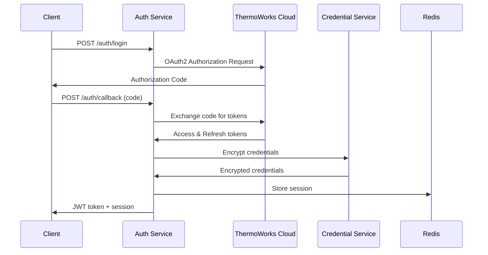
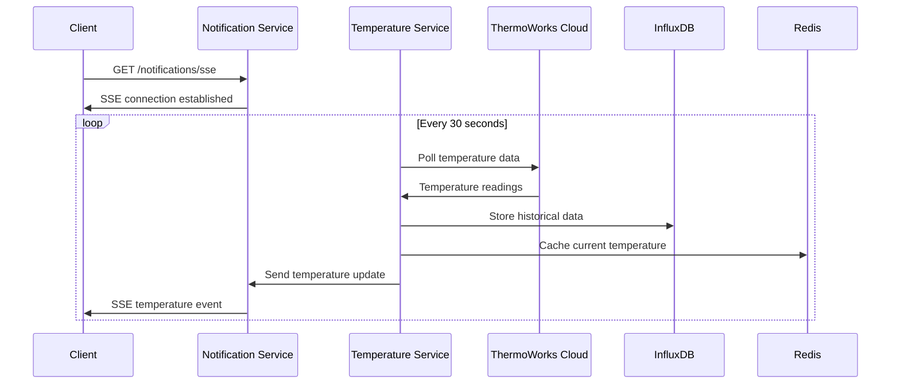

# ThermoWorks BBQ Monitoring Application - System Architecture

## Executive Summary

This document defines the comprehensive system architecture for a ThermoWorks BBQ monitoring application that provides real-time temperature monitoring, historical data visualization, and secure credential management through a microservices-based architecture deployed on Kubernetes.

## System Overview

### High-Level Architecture

```
┌─────────────────────────────────────────────────────────────────────────────────┐
│                                 Client Layer                                    │
├─────────────────────────────────────────────────────────────────────────────────┤
│  React Web App (Port 3000)                                                     │
│  ┌─────────────────┐ ┌─────────────────┐ ┌─────────────────┐ ┌─────────────────┐│
│  │  Login Page     │ │  Device List    │ │  Live Dashboard │ │  Historical     ││
│  │  - Auth Form    │ │  - Device Cards │ │  - Real-time    │ │  - Cook Graphs  ││
│  │  - Session Mgmt │ │  - Status Info  │ │  - Temperature  │ │  - Date Range   ││
│  │                 │ │                 │ │  - Charts       │ │  - Export       ││
│  └─────────────────┘ └─────────────────┘ └─────────────────┘ └─────────────────┘│
└─────────────────────────────────────────────────────────────────────────────────┘
                                     │
                                     ▼
┌─────────────────────────────────────────────────────────────────────────────────┐
│                              API Gateway Layer                                  │
├─────────────────────────────────────────────────────────────────────────────────┤
│  Traefik Reverse Proxy (Port 80/443)                                          │
│  ┌─────────────────┐ ┌─────────────────┐ ┌─────────────────┐ ┌─────────────────┐│
│  │  Rate Limiting  │ │  SSL/TLS        │ │  Load Balancing │ │  Request        ││
│  │  Circuit Breaker│ │  Cert Manager   │ │  Health Checks  │ │  Routing        ││
│  └─────────────────┘ └─────────────────┘ └─────────────────┘ └─────────────────┘│
└─────────────────────────────────────────────────────────────────────────────────┘
                                     │
                                     ▼
┌─────────────────────────────────────────────────────────────────────────────────┐
│                            Microservices Layer                                 │
├─────────────────────────────────────────────────────────────────────────────────┤
│  ┌─────────────────┐ ┌─────────────────┐ ┌─────────────────┐ ┌─────────────────┐│
│  │  Auth Service   │ │  Device Service │ │  Temperature    │ │  Historical     ││
│  │  Port 8080      │ │  Port 8081      │ │  Service        │ │  Data Service   ││
│  │                 │ │                 │ │  Port 8082      │ │  Port 8083      ││
│  │  - JWT Auth     │ │  - Device Mgmt  │ │  - Real-time    │ │  - Cook Data    ││
│  │  - Session Mgmt │ │  - TW Cloud API │ │  - Polling      │ │  - Analytics    ││
│  │  - Encryption   │ │  - Caching      │ │  - SSE Streams  │ │  - Exports      ││
│  └─────────────────┘ └─────────────────┘ └─────────────────┘ └─────────────────┘│
│                                     │                                           │
│  ┌─────────────────┐                │                 ┌─────────────────┐       │
│  │  Credential     │                │                 │  Notification   │       │
│  │  Service        │                │                 │  Service        │       │
│  │  Port 8084      │                │                 │  Port 8085      │       │
│  │                 │                │                 │                 │       │
│  │  - AES-256      │                │                 │  - WebSocket    │       │
│  │  - Key Mgmt     │                │                 │  - SSE          │       │
│  │  - Vault        │                │                 │  - Alerts       │       │
│  └─────────────────┘                │                 └─────────────────┘       │
└─────────────────────────────────────────────────────────────────────────────────┘
                                     │
                                     ▼
┌─────────────────────────────────────────────────────────────────────────────────┐
│                              Data Layer                                        │
├─────────────────────────────────────────────────────────────────────────────────┤
│  ┌─────────────────┐ ┌─────────────────┐ ┌─────────────────┐ ┌─────────────────┐│
│  │  PostgreSQL     │ │  Redis          │ │  InfluxDB       │ │  HashiCorp      ││
│  │  Port 5432      │ │  Port 6379      │ │  Port 8086      │ │  Vault          ││
│  │                 │ │                 │ │                 │ │  Port 8200      ││
│  │  - User Data    │ │  - Session Store│ │  - Time Series  │ │  - Encryption   ││
│  │  - Device Meta  │ │  - Caching      │ │  - Metrics      │ │  - Key Mgmt     ││
│  │  - Cook Sessions│ │  - Real-time    │ │  - Retention    │ │  - Secrets      ││
│  └─────────────────┘ └─────────────────┘ └─────────────────┘ └─────────────────┘│
└─────────────────────────────────────────────────────────────────────────────────┘
                                     │
                                     ▼
┌─────────────────────────────────────────────────────────────────────────────────┐
│                            External Services                                   │
├─────────────────────────────────────────────────────────────────────────────────┤
│  ┌─────────────────┐ ┌─────────────────┐ ┌─────────────────┐ ┌─────────────────┐│
│  │  ThermoWorks    │ │  Monitoring     │ │  Alerting       │ │  Logging        ││
│  │  Cloud API      │ │  Stack          │ │  Stack          │ │  Stack          ││
│  │                 │ │                 │ │                 │ │                 ││
│  │  - OAuth2       │ │  - Prometheus   │ │  - AlertManager │ │  - Grafana      ││
│  │  - Device API   │ │  - Grafana      │ │  - PagerDuty    │ │  - Loki         ││
│  │  - Rate Limits  │ │  - Jaeger       │ │  - Slack        │ │  - Fluent Bit   ││
│  └─────────────────┘ └─────────────────┘ └─────────────────┘ └─────────────────┘│
└─────────────────────────────────────────────────────────────────────────────────┘
```

## Service Definitions and Responsibilities

### 1. Authentication Service (Port 8080)

**Primary Responsibilities:**
- ThermoWorks Cloud OAuth2 authentication
- JWT token generation and validation
- Session management and refresh
- User profile management
- Integration with Credential Service for secure storage

**Key Features:**
- OAuth2 flow with ThermoWorks Cloud
- JWT-based authentication with refresh tokens
- Session persistence in Redis
- Rate limiting for authentication attempts
- Integration with python-thermoworks-cloud library

**API Endpoints:**
```
POST /auth/login              # Initiate OAuth2 flow
POST /auth/callback          # OAuth2 callback handler
POST /auth/refresh           # Refresh JWT tokens
POST /auth/logout            # Invalidate session
GET  /auth/profile           # Get user profile
GET  /auth/health            # Health check
```

### 2. Device Management Service (Port 8081)

**Primary Responsibilities:**
- Device discovery and listing
- Device metadata management
- ThermoWorks Cloud API integration
- Device status monitoring
- Caching for performance

**Key Features:**
- Integration with ThermoWorks Cloud API
- Device metadata caching in Redis
- Device status monitoring
- Multi-device support
- Rate limiting for external API calls

**API Endpoints:**
```
GET    /devices              # List user's devices
GET    /devices/{id}         # Get specific device details
POST   /devices/{id}/sync    # Force device sync
GET    /devices/{id}/status  # Get device status
PUT    /devices/{id}         # Update device settings
GET    /devices/health       # Health check
```

### 3. Temperature Data Service (Port 8082)

**Primary Responsibilities:**
- Real-time temperature data polling
- Temperature data streaming via SSE
- Real-time data caching
- Temperature alert processing
- Integration with notification service

**Key Features:**
- Real-time temperature polling from ThermoWorks Cloud
- Server-Sent Events (SSE) for real-time updates
- Redis caching for current temperatures
- Configurable polling intervals
- Temperature threshold alerts

**API Endpoints:**
```
GET    /temperature/{device_id}/current    # Current temperature
GET    /temperature/{device_id}/stream     # SSE stream
POST   /temperature/{device_id}/alerts    # Configure alerts
GET    /temperature/{device_id}/alerts    # List alerts
DELETE /temperature/{device_id}/alerts/{id} # Remove alert
GET    /temperature/health                # Health check
```

### 4. Historical Data Service (Port 8083)

**Primary Responsibilities:**
- Historical temperature data storage
- Cook session management
- Data aggregation and analytics
- Export functionality
- Long-term data retention

**Key Features:**
- InfluxDB time-series storage
- Cook session tracking
- Data aggregation (hourly, daily averages)
- Export to CSV/JSON formats
- Configurable retention policies

**API Endpoints:**
```
GET    /historical/{device_id}                    # Get historical data
POST   /historical/{device_id}/sessions          # Create cook session
GET    /historical/{device_id}/sessions          # List cook sessions
GET    /historical/{device_id}/sessions/{id}     # Get session details
DELETE /historical/{device_id}/sessions/{id}     # Delete session
GET    /historical/{device_id}/export            # Export data
GET    /historical/health                        # Health check
```

### 5. Credential Service (Port 8084)

**Primary Responsibilities:**
- AES-256 encryption for ThermoWorks credentials
- Secure key management
- Credential rotation
- Integration with HashiCorp Vault
- Audit logging

**Key Features:**
- AES-256-GCM encryption
- Key rotation and versioning
- HashiCorp Vault integration
- Audit trail for credential access
- Secure key derivation

**API Endpoints:**
```
POST   /credentials/encrypt   # Encrypt credentials
POST   /credentials/decrypt   # Decrypt credentials
POST   /credentials/rotate    # Rotate encryption keys
GET    /credentials/audit     # Audit log
GET    /credentials/health    # Health check
```

### 6. Notification Service (Port 8085)

**Primary Responsibilities:**
- Real-time WebSocket connections
- Server-Sent Events (SSE) streaming
- Temperature alerts
- System notifications
- Connection management

**Key Features:**
- WebSocket support for real-time updates
- SSE fallback for older browsers
- Temperature threshold alerts
- System status notifications
- Connection pooling and management

**API Endpoints:**
```
GET    /notifications/ws              # WebSocket endpoint
GET    /notifications/sse             # SSE endpoint
POST   /notifications/send            # Send notification
GET    /notifications/health          # Health check
```

## Database Schema Design

### PostgreSQL Schema

```sql
-- Users table
CREATE TABLE users (
    id UUID PRIMARY KEY DEFAULT gen_random_uuid(),
    thermoworks_user_id VARCHAR(255) UNIQUE NOT NULL,
    email VARCHAR(255) UNIQUE NOT NULL,
    display_name VARCHAR(255),
    encrypted_credentials TEXT NOT NULL,
    credential_version INTEGER DEFAULT 1,
    created_at TIMESTAMP WITH TIME ZONE DEFAULT NOW(),
    updated_at TIMESTAMP WITH TIME ZONE DEFAULT NOW(),
    last_login TIMESTAMP WITH TIME ZONE,
    is_active BOOLEAN DEFAULT TRUE
);

-- Devices table
CREATE TABLE devices (
    id UUID PRIMARY KEY DEFAULT gen_random_uuid(),
    user_id UUID REFERENCES users(id) ON DELETE CASCADE,
    thermoworks_device_id VARCHAR(255) NOT NULL,
    device_name VARCHAR(255),
    device_type VARCHAR(100),
    device_model VARCHAR(100),
    firmware_version VARCHAR(50),
    last_seen TIMESTAMP WITH TIME ZONE,
    is_online BOOLEAN DEFAULT FALSE,
    settings JSONB DEFAULT '{}',
    created_at TIMESTAMP WITH TIME ZONE DEFAULT NOW(),
    updated_at TIMESTAMP WITH TIME ZONE DEFAULT NOW(),
    UNIQUE(user_id, thermoworks_device_id)
);

-- Cook sessions table
CREATE TABLE cook_sessions (
    id UUID PRIMARY KEY DEFAULT gen_random_uuid(),
    user_id UUID REFERENCES users(id) ON DELETE CASCADE,
    device_id UUID REFERENCES devices(id) ON DELETE CASCADE,
    session_name VARCHAR(255),
    start_time TIMESTAMP WITH TIME ZONE NOT NULL,
    end_time TIMESTAMP WITH TIME ZONE,
    target_temperature DECIMAL(5,2),
    notes TEXT,
    tags TEXT[],
    is_active BOOLEAN DEFAULT TRUE,
    created_at TIMESTAMP WITH TIME ZONE DEFAULT NOW(),
    updated_at TIMESTAMP WITH TIME ZONE DEFAULT NOW()
);

-- Temperature alerts table
CREATE TABLE temperature_alerts (
    id UUID PRIMARY KEY DEFAULT gen_random_uuid(),
    user_id UUID REFERENCES users(id) ON DELETE CASCADE,
    device_id UUID REFERENCES devices(id) ON DELETE CASCADE,
    alert_type VARCHAR(50) NOT NULL, -- 'HIGH', 'LOW', 'TARGET'
    threshold_temperature DECIMAL(5,2) NOT NULL,
    probe_number INTEGER DEFAULT 1,
    is_enabled BOOLEAN DEFAULT TRUE,
    notification_methods TEXT[] DEFAULT '{"email"}',
    created_at TIMESTAMP WITH TIME ZONE DEFAULT NOW(),
    updated_at TIMESTAMP WITH TIME ZONE DEFAULT NOW()
);

-- User sessions table
CREATE TABLE user_sessions (
    id UUID PRIMARY KEY DEFAULT gen_random_uuid(),
    user_id UUID REFERENCES users(id) ON DELETE CASCADE,
    session_token VARCHAR(255) UNIQUE NOT NULL,
    refresh_token VARCHAR(255) UNIQUE NOT NULL,
    expires_at TIMESTAMP WITH TIME ZONE NOT NULL,
    user_agent TEXT,
    ip_address INET,
    is_active BOOLEAN DEFAULT TRUE,
    created_at TIMESTAMP WITH TIME ZONE DEFAULT NOW(),
    last_accessed TIMESTAMP WITH TIME ZONE DEFAULT NOW()
);

-- Audit log table
CREATE TABLE audit_log (
    id UUID PRIMARY KEY DEFAULT gen_random_uuid(),
    user_id UUID REFERENCES users(id) ON DELETE SET NULL,
    action VARCHAR(100) NOT NULL,
    resource_type VARCHAR(100),
    resource_id UUID,
    details JSONB,
    ip_address INET,
    user_agent TEXT,
    created_at TIMESTAMP WITH TIME ZONE DEFAULT NOW()
);

-- Indexes for performance
CREATE INDEX idx_users_thermoworks_id ON users(thermoworks_user_id);
CREATE INDEX idx_users_email ON users(email);
CREATE INDEX idx_devices_user_id ON devices(user_id);
CREATE INDEX idx_devices_thermoworks_id ON devices(thermoworks_device_id);
CREATE INDEX idx_cook_sessions_user_device ON cook_sessions(user_id, device_id);
CREATE INDEX idx_cook_sessions_active ON cook_sessions(is_active) WHERE is_active = TRUE;
CREATE INDEX idx_temperature_alerts_device ON temperature_alerts(device_id);
CREATE INDEX idx_user_sessions_token ON user_sessions(session_token);
CREATE INDEX idx_user_sessions_active ON user_sessions(is_active) WHERE is_active = TRUE;
CREATE INDEX idx_audit_log_user_action ON audit_log(user_id, action);
CREATE INDEX idx_audit_log_created_at ON audit_log(created_at);
```

### InfluxDB Schema

```sql
-- Temperature measurements
CREATE DATABASE thermoworks_temperatures;

-- Temperature data points
temperature,device_id=<device_id>,probe=<probe_number>,user_id=<user_id>
  value=<temperature>,
  target=<target_temp>,
  ambient=<ambient_temp>
  <timestamp>

-- Device status metrics
device_status,device_id=<device_id>,user_id=<user_id>
  battery_level=<percentage>,
  signal_strength=<rssi>,
  is_online=<boolean>
  <timestamp>

-- Cook session metrics
cook_metrics,session_id=<session_id>,device_id=<device_id>,user_id=<user_id>
  duration=<seconds>,
  avg_temp=<temperature>,
  max_temp=<temperature>,
  min_temp=<temperature>
  <timestamp>

-- Retention policies
CREATE RETENTION POLICY "realtime" ON "thermoworks_temperatures" DURATION 7d REPLICATION 1 DEFAULT;
CREATE RETENTION POLICY "hourly" ON "thermoworks_temperatures" DURATION 90d REPLICATION 1;
CREATE RETENTION POLICY "daily" ON "thermoworks_temperatures" DURATION 2y REPLICATION 1;
```

### Redis Schema

```
# User sessions
session:{session_token} -> {user_id, expires_at, user_data}

# Device cache
device:{device_id} -> {device_data, last_updated}
user_devices:{user_id} -> [device_id1, device_id2, ...]

# Real-time temperature cache
temp:{device_id}:{probe} -> {temperature, timestamp}

# ThermoWorks API rate limiting
rate_limit:{user_id} -> {requests_count, window_start}

# WebSocket connections
connections:{user_id} -> [connection_id1, connection_id2, ...]

# Temperature alerts
alerts:{device_id} -> {alert_configs}
```

## API Design Specifications

### Authentication Flow



### Real-time Temperature Flow



### Security Architecture

#### Authentication & Authorization

1. **OAuth2 Flow with ThermoWorks Cloud**
   - Authorization Code flow with PKCE
   - Secure token storage with AES-256 encryption
   - JWT tokens for service-to-service communication

2. **Session Management**
   - Redis-backed session storage
   - Configurable session timeout
   - Session invalidation on logout

3. **API Security**
   - JWT bearer token authentication
   - Rate limiting per user/endpoint
   - CORS configuration for web clients
   - API key authentication for internal services

#### Data Protection

1. **Encryption at Rest**
   - AES-256-GCM for ThermoWorks credentials
   - PostgreSQL encryption for sensitive data
   - HashiCorp Vault for key management

2. **Encryption in Transit**
   - TLS 1.3 for all external communication
   - mTLS for internal service communication
   - WebSocket Secure (WSS) for real-time connections

3. **Credential Management**
   - No plaintext credentials in code or config
   - Secure key derivation (PBKDF2/Argon2)
   - Key rotation capabilities
   - Audit logging for credential access

#### Network Security

```yaml
# Kubernetes NetworkPolicy example
apiVersion: networking.k8s.io/v1
kind: NetworkPolicy
metadata:
  name: thermoworks-network-policy
spec:
  podSelector:
    matchLabels:
      app: thermoworks
  policyTypes:
  - Ingress
  - Egress
  ingress:
  - from:
    - podSelector:
        matchLabels:
          app: traefik
    ports:
    - protocol: TCP
      port: 8080
  egress:
  - to:
    - podSelector:
        matchLabels:
          app: postgresql
    ports:
    - protocol: TCP
      port: 5432
  - to:
    - podSelector:
        matchLabels:
          app: redis
    ports:
    - protocol: TCP
      port: 6379
```

## Technology Stack Recommendations

### Backend Services

1. **Python 3.11+**
   - FastAPI for high-performance APIs
   - Pydantic for data validation
   - SQLAlchemy for ORM
   - Alembic for database migrations

2. **Database Technologies**
   - PostgreSQL 15+ for relational data
   - Redis 7+ for caching and sessions
   - InfluxDB 2.0+ for time-series data
   - HashiCorp Vault for secrets management

3. **Integration Libraries**
   - python-thermoworks-cloud for ThermoWorks API
   - cryptography for encryption
   - PyJWT for JWT handling
   - asyncio for concurrent processing

### Frontend Application

1. **React 18+**
   - TypeScript for type safety
   - React Query for API state management
   - Chart.js for temperature visualizations
   - Material-UI for component library

2. **Real-time Features**
   - EventSource API for SSE
   - WebSocket API for real-time updates
   - React hooks for state management
   - Service workers for offline capability

### Infrastructure

1. **Containerization**
   - Docker for container images
   - Multi-stage builds for optimization
   - Distroless base images for security
   - Health checks for all services

2. **Kubernetes Deployment**
   - Kustomize for configuration management
   - ArgoCD for GitOps deployment
   - Prometheus for monitoring
   - Grafana for observability

## Deployment Architecture

### Kubernetes Manifests Structure

```
k8s/
├── base/
│   ├── auth-service/
│   │   ├── deployment.yaml
│   │   ├── service.yaml
│   │   ├── configmap.yaml
│   │   └── kustomization.yaml
│   ├── device-service/
│   ├── temperature-service/
│   ├── historical-service/
│   ├── credential-service/
│   ├── notification-service/
│   ├── web-ui/
│   └── databases/
│       ├── postgresql/
│       ├── redis/
│       └── influxdb/
├── overlays/
│   ├── dev/
│   ├── staging/
│   └── prod/
└── secrets/
    ├── thermoworks-credentials/
    ├── database-passwords/
    └── jwt-secrets/
```

### Service Deployment Example

```yaml
# auth-service deployment
apiVersion: apps/v1
kind: Deployment
metadata:
  name: auth-service
  labels:
    app: auth-service
    version: v1.0.0
spec:
  replicas: 3
  selector:
    matchLabels:
      app: auth-service
  template:
    metadata:
      labels:
        app: auth-service
    spec:
      containers:
      - name: auth-service
        image: thermoworks/auth-service:v1.0.0
        ports:
        - containerPort: 8080
        env:
        - name: DATABASE_URL
          valueFrom:
            secretKeyRef:
              name: database-secret
              key: url
        - name: REDIS_URL
          valueFrom:
            secretKeyRef:
              name: redis-secret
              key: url
        - name: JWT_SECRET
          valueFrom:
            secretKeyRef:
              name: jwt-secret
              key: secret
        livenessProbe:
          httpGet:
            path: /health
            port: 8080
          initialDelaySeconds: 30
          periodSeconds: 10
        readinessProbe:
          httpGet:
            path: /health
            port: 8080
          initialDelaySeconds: 5
          periodSeconds: 5
        resources:
          requests:
            memory: "256Mi"
            cpu: "100m"
          limits:
            memory: "512Mi"
            cpu: "500m"
        securityContext:
          allowPrivilegeEscalation: false
          readOnlyRootFilesystem: true
          runAsNonRoot: true
          runAsUser: 1000
---
apiVersion: v1
kind: Service
metadata:
  name: auth-service
spec:
  selector:
    app: auth-service
  ports:
  - port: 8080
    targetPort: 8080
  type: ClusterIP
```

## Monitoring and Observability

### Metrics Collection

```yaml
# Prometheus ServiceMonitor
apiVersion: monitoring.coreos.com/v1
kind: ServiceMonitor
metadata:
  name: thermoworks-metrics
spec:
  selector:
    matchLabels:
      monitoring: enabled
  endpoints:
  - port: metrics
    interval: 30s
    path: /metrics
```

### Key Metrics to Monitor

1. **Application Metrics**
   - Request rate and response times
   - Error rates by service
   - Temperature polling success rate
   - WebSocket connection count

2. **Business Metrics**
   - Active users and devices
   - Temperature readings per hour
   - Cook session duration
   - Alert frequency

3. **Infrastructure Metrics**
   - CPU and memory usage
   - Database connection pools
   - Cache hit rates
   - Network latency

### Logging Strategy

1. **Structured Logging**
   - JSON format for all logs
   - Correlation IDs for request tracing
   - User ID and device ID context
   - Appropriate log levels

2. **Log Aggregation**
   - Fluent Bit for log collection
   - Loki for log storage
   - Grafana for log visualization
   - Alerting on error patterns

### Distributed Tracing

1. **OpenTelemetry Integration**
   - Trace context propagation
   - Span creation for external API calls
   - Database query tracing
   - Cross-service correlation

## Performance Considerations

### Caching Strategy

1. **Redis Caching**
   - Device metadata (5 minutes TTL)
   - Current temperature readings (30 seconds TTL)
   - User session data (configurable TTL)
   - ThermoWorks API rate limiting

2. **Database Optimization**
   - Connection pooling
   - Query optimization with indexes
   - Read replicas for historical data
   - Partitioning for large datasets

### Scalability Design

1. **Horizontal Scaling**
   - Stateless service design
   - Load balancing across replicas
   - Database connection pooling
   - Cache sharing across instances

2. **Rate Limiting**
   - Per-user API rate limiting
   - ThermoWorks Cloud API respect
   - Backoff strategies for failures
   - Circuit breakers for resilience

## Error Handling and Resilience

### Error Handling Strategy

1. **Graceful Degradation**
   - Fallback to cached data
   - Offline mode for mobile apps
   - Retry mechanisms with exponential backoff
   - Circuit breakers for external services

2. **Error Response Format**
```json
{
  "error": {
    "code": "DEVICE_NOT_FOUND",
    "message": "Device not found or not accessible",
    "details": {
      "device_id": "abc123",
      "user_id": "user456"
    },
    "timestamp": "2024-01-15T10:30:00Z",
    "trace_id": "trace789"
  }
}
```

### Resilience Patterns

1. **Circuit Breaker**
   - Prevent cascading failures
   - Automatic recovery detection
   - Configurable failure thresholds
   - Monitoring and alerting

2. **Retry Logic**
   - Exponential backoff
   - Jitter for thundering herd
   - Maximum retry limits
   - Idempotent operations

## Security Best Practices

### Development Security

1. **Secret Management**
   - No secrets in code or config files
   - 1Password Connect for development
   - HashiCorp Vault for production
   - Regular secret rotation

2. **Code Security**
   - Dependency scanning with Snyk
   - Static analysis with SonarQube
   - Container image scanning
   - Regular security updates

### Runtime Security

1. **Container Security**
   - Non-root user execution
   - Read-only file systems
   - Minimal base images
   - Security context enforcement

2. **Network Security**
   - Network policies for pod communication
   - Service mesh for mTLS
   - Ingress TLS termination
   - Private container registries

## Disaster Recovery

### Backup Strategy

1. **Database Backups**
   - PostgreSQL automated backups
   - InfluxDB snapshot backups
   - Redis persistence configuration
   - Cross-region backup storage

2. **Configuration Backups**
   - GitOps repository backups
   - Kubernetes cluster configuration
   - Secret manager backups
   - Infrastructure as Code state

### Recovery Procedures

1. **Service Recovery**
   - Automated health checks
   - Rolling deployment rollbacks
   - Database recovery procedures
   - Traffic routing during outages

2. **Data Recovery**
   - Point-in-time database recovery
   - Time-series data restoration
   - Session state reconstruction
   - User notification procedures

## Conclusion

This architecture provides a comprehensive, scalable, and secure foundation for the ThermoWorks BBQ monitoring application. The microservices design ensures maintainability and allows for independent scaling of different components. The security-first approach with encrypted credential storage and comprehensive authentication meets the requirements for handling sensitive user data.

The real-time capabilities through WebSocket and SSE connections provide an excellent user experience, while the historical data storage and visualization features enable users to analyze their cooking patterns over time.

The Kubernetes deployment strategy aligns with modern DevOps practices and provides the flexibility to scale the application as the user base grows. The comprehensive monitoring and observability features ensure the system can be properly maintained and optimized in production.
